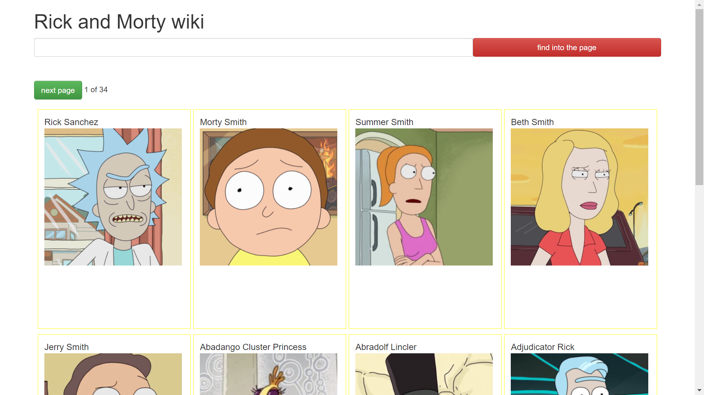
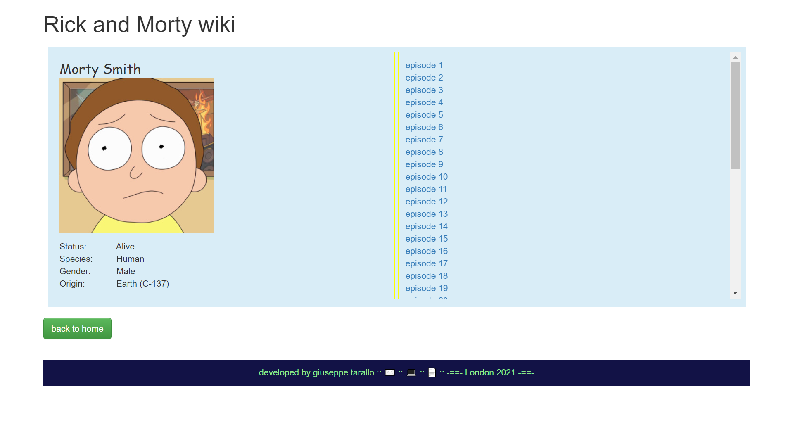

### Rick and Morty wiki
----------------------------


Description of the project
==========================

This is an application based on the structure offered by the PHP Laravel framework, even if it was then almost entirely developed with the React frontend framework.

The project allows you to create a simple application that provides information relating to the protagonists of the animated series Rick and Morty

<br> <br>
`This is what the application interface looks like`


<br>



<br>
<br>
<br>



<br>
<br>


Through the search box it is possible to filter the preferences based on their name.


By clicking on the individual character, the description of his characteristics will appear:

* his image
* His first name
* The species
* Origin
* Episodes in which it appears

<br>
<br>

Commands required for installing third-party modules:
<br>
<br>


```
$composer install   
$npm install            
$composer require laravel/ui    
$php artisan ui react   
$npm install && npm run dev     
```

<br>
<br>


*Recommended command, to recompile resources on the fly:* 

<br>

``
    npm run watch
``

<br>
<br>


*execute local develop server*
$php artisan serve

Descrizione del progetto
===========================

Questa e' un applicazione basata sulla struttura offerta dal framework PHP Laravel, anche se poi e' stata quasi interamente sviluppata con frontend framework React.

Il progetto permette di creare una semplice applicazione che fornisce delle informazioni inerenti ai protagonisti della serie animata Rick and Morty

<br>


Tramite la casella di ricerca si puo' essettuare il filtro dei prsonaggi basato sul loro nome.


Cliccando sul singolo personaggio apparira' la scheda della descrizione delle sua carattaristiche:

* la sua immagine
* Il suo nome di battesimo
* La specie
* Origine
* Episodi in cui compare

<br>
<br>

Comandi richiesti per l'installazione dei moduli di terze parti:
<br>
<br>


```
$composer install   
$npm install            
$composer require laravel/ui    
$php artisan ui react   
$npm install && npm run dev     
```

<br>
<br>

*Comando Consigliato, per ricompilare le risorse al volo:*

<br>

```
npm run watch
```

<br>
<br>

*Per eseguire il server di sviluppo locale*

```
$php artisan serve
```

<br>
<br>
<br>


Applicazione realizzata da [giuseppe tarallo](https://www.dev-ita.it) , London 2012
